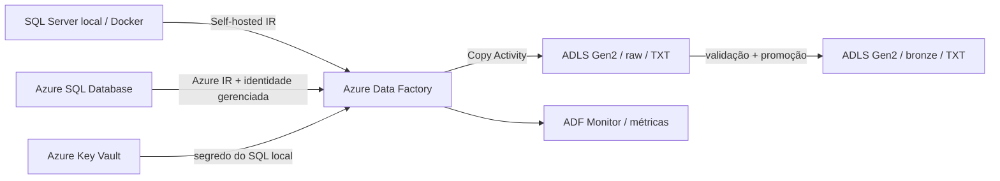

# Azure Data Factory: SQL para Data Lake

Projeto prático, reproduzível e orientado a portfólio para copiar dados de SQL Server local e Azure SQL Database para o Azure Data Lake Storage Gen2 com Azure Data Factory (ADF). Os dados são preservados em arquivos `.txt` nas camadas `raw` e `bronze`, com validação de consistência, identidade gerenciada, segredos no Key Vault e infraestrutura como código em Bicep.

## O que este repositório entrega

- infraestrutura Azure: Data Factory, Data Lake Gen2, Key Vault e Azure SQL Database;
- Self-hosted Integration Runtime para acessar o SQL Server em rede local;
- linked services sem senhas gravadas no Git;
- datasets parametrizados para tabelas SQL e arquivos delimitados;
- pipelines para SQL local e Azure SQL, com promoção `raw` → `bronze`;
- validação de linhas copiadas, consistência da cópia, retentativas e falha explícita;
- ambiente SQL Server local opcional em Docker, com dados de exemplo;
- scripts de implantação, testes estáticos e validação contínua no GitHub Actions;
- runbook, arquitetura, segurança, desempenho e troubleshooting em português.

## Arquitetura



Os arquivos seguem o padrão:

```text
raw/<origem>/<schema>/<tabela>/yyyy/MM/dd/<tabela>_<timestamp>_<run-id>.txt
bronze/<origem>/<schema>/<tabela>/yyyy/MM/dd/<tabela>_<timestamp>_<run-id>.txt
```

Veja as decisões e os limites do laboratório em [docs/architecture.md](docs/architecture.md).

## Pré-requisitos

- uma assinatura Azure e permissão para criar recursos e atribuir papéis RBAC;
- [Azure CLI](https://learn.microsoft.com/cli/azure/install-azure-cli) autenticado;
- PowerShell 7 ou Windows PowerShell 5.1;
- Docker Desktop, apenas para usar o SQL Server local de exemplo;
- uma máquina Windows com acesso ao SQL local para instalar o Self-hosted Integration Runtime.

> O laboratório cria recursos cobrados pela Azure. Use uma assinatura de testes e execute a limpeza ao terminar.

## Início rápido

### 1. Autentique-se e selecione a assinatura

```powershell
az login
az account set --subscription "<ID-OU-NOME-DA-ASSINATURA>"
```

### 2. Suba o SQL Server local de exemplo (opcional)

```powershell
Copy-Item .env.example .env
# Edite .env e defina uma senha forte para o usuário sa.
docker compose up -d
./scripts/bootstrap-local-sql.ps1
```

O script cria `SourceDb.dbo.Orders` e o login de leitura `adf_reader`.

### 3. Implante a infraestrutura

```powershell
./scripts/deploy-infrastructure.ps1 `
  -ResourceGroupName "rg-adf-sql-lab" `
  -Prefix "sql2lake" `
  -Location "brazilsouth"
```

O script solicita a senha administrativa do Azure SQL de forma interativa e exibe os nomes gerados. Nenhuma senha é salva no repositório.

### 4. Cadastre o segredo do SQL local

```powershell
./scripts/set-onprem-secret.ps1 `
  -KeyVaultName "<KEY-VAULT-GERADO>" `
  -SecretName "sql-onprem-password"
```

Use a mesma senha informada para `adf_reader` no bootstrap local.

### 5. Publique os artefatos do Data Factory

```powershell
./scripts/deploy-adf.ps1 `
  -ResourceGroupName "rg-adf-sql-lab" `
  -FactoryName "<DATA-FACTORY-GERADO>" `
  -StorageAccountName "<STORAGE-GERADO>" `
  -KeyVaultName "<KEY-VAULT-GERADO>" `
  -AzureSqlServerName "<SQL-SERVER-GERADO>" `
  -AzureSqlDatabaseName "sqldb" `
  -OnPremSqlServer "host.docker.internal,1433" `
  -OnPremSqlDatabase "SourceDb" `
  -OnPremSqlUser "adf_reader"
```

### 6. Configure o Self-hosted Integration Runtime

No portal Azure, abra o Data Factory → **Manage** → **Integration runtimes** → `ir-selfhosted-onprem`. Baixe e instale o runtime na máquina Windows que alcança o SQL Server e registre-o com uma das chaves exibidas pelo portal.

O IR faz conexões de saída por HTTPS; não exponha a porta do SQL Server à internet. Para alta disponibilidade, instale um segundo nó no mesmo IR.

### 7. Autorize o Data Factory no Azure SQL

Defina um administrador Microsoft Entra no SQL Server lógico e execute [scripts/sql/02-grant-adf-azure-sql.sql](scripts/sql/02-grant-adf-azure-sql.sql) no banco `sqldb`, substituindo `adf-sql2lake-...` pelo nome real da fábrica. Depois, se desejar testar a origem Azure SQL, execute [scripts/sql/03-create-azure-sql-source.sql](scripts/sql/03-create-azure-sql-source.sql).

### 8. Execute e valide

No ADF Studio, publique e execute uma das pipelines:

- `pl_ingest_onprem_sql_to_raw`: usa `dbo` e `Orders` por padrão;
- `pl_ingest_azure_sql_to_raw`: usa a mesma tabela no Azure SQL;
- `pl_promote_raw_to_bronze`: é chamada pelas pipelines de ingestão.

Confirme no Data Lake a existência dos arquivos em `raw` e `bronze`. O guia completo está em [docs/runbook.md](docs/runbook.md).

## Validação local

```powershell
python tests/validate_artifacts.py
az bicep build --file infra/main.bicep --stdout | Out-Null
```

O primeiro comando não exige bibliotecas externas. A mesma verificação roda a cada push e pull request.

## Estrutura

```text
.
├── adf/                  # linked services, datasets, IR e pipelines
├── infra/                # Bicep modular
├── scripts/              # deploy, bootstrap e SQL
├── tests/                # validação estática dos artefatos
├── docs/                 # arquitetura, runbook e boas práticas
├── docker-compose.yml    # SQL Server local opcional
└── README.md
```

## Segurança e custos

- o ADF usa identidade gerenciada no Data Lake e no Azure SQL;
- a senha do SQL local é lida do Key Vault;
- nenhum segredo real deve entrar no Git;
- a conta de armazenamento bloqueia acesso público a blobs;
- o SKU `Basic` do Azure SQL reduz o custo do laboratório, mas ainda gera cobrança;
- para produção, adote endpoints privados, firewall restrito, rotação de segredos e proteção contra purge no Key Vault.

Detalhes em [docs/security-performance.md](docs/security-performance.md).

## Limpeza

Após concluir o laboratório:

```powershell
az group delete --name "rg-adf-sql-lab"
```

Revise cuidadosamente o nome antes de confirmar: a exclusão do grupo remove todos os recursos do laboratório.

## Referências oficiais

- [Conector SQL Server do Azure Data Factory](https://learn.microsoft.com/azure/data-factory/connector-sql-server)
- [Conector Azure SQL Database](https://learn.microsoft.com/azure/data-factory/connector-azure-sql-database)
- [Conector Azure Data Lake Storage Gen2](https://learn.microsoft.com/azure/data-factory/connector-azure-data-lake-storage)
- [Formato de texto delimitado](https://learn.microsoft.com/azure/data-factory/format-delimited-text)
- [Monitoramento da Copy Activity](https://learn.microsoft.com/azure/data-factory/copy-activity-monitoring)

## Licença

Distribuído sob a licença MIT. Consulte [LICENSE](LICENSE).
