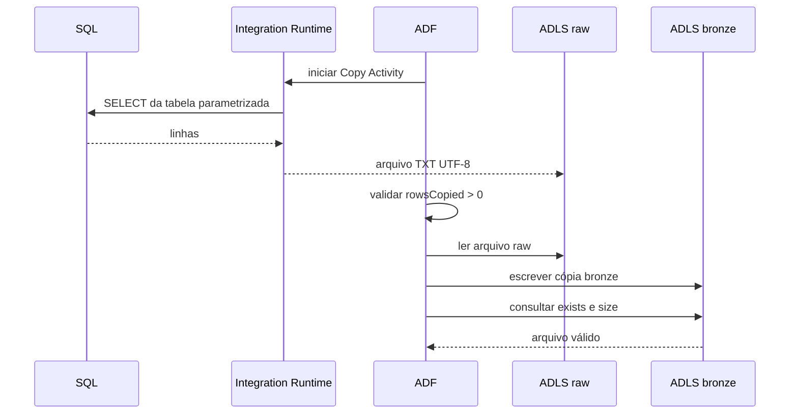

# Arquitetura e decisões

## Fluxo de dados

O projeto oferece duas origens com o mesmo contrato de saída:

1. o SQL Server local é acessado pelo Self-hosted Integration Runtime (SHIR);
2. o Azure SQL Database é acessado pelo Azure Integration Runtime padrão;
3. a Copy Activity serializa a tabela como texto delimitado UTF-8 com cabeçalho;
4. o arquivo é escrito em `raw`, preservando origem, tabela, data e Run ID;
5. a pipeline valida `rowsCopied`; zero linhas gera falha explícita neste laboratório;
6. uma pipeline filha copia o arquivo para `bronze` com verificação de consistência;
7. Get Metadata confirma que o arquivo bronze existe e possui conteúdo.

## Responsabilidade das camadas

| Camada | Contrato deste laboratório | Política recomendada |
|---|---|---|
| `raw` | cópia por execução, com nome único e sem sobrescrita intencional | imutável, retenção definida e acesso restrito |
| `bronze` | cópia técnica validada do arquivo raw | padronização leve, schema auditável e reprocessamento a partir de raw |

A promoção atual preserva o formato TXT. Em um projeto analítico real, a bronze normalmente adicionaria schema explícito, metadados de ingestão e conversão para Parquet/Delta. Essa extensão foi mantida fora do escopo para atender ao requisito de arquivos `.txt` nas duas camadas.

## Componentes

| Componente | Função |
|---|---|
| Azure Data Factory | orquestra as cópias, validações e retentativas |
| Self-hosted IR | cria a ponte de saída entre a rede local e o ADF |
| Azure SQL Database | segunda origem para comparação com o cenário local |
| ADLS Gen2 | armazena `raw` e `bronze` com namespace hierárquico |
| Key Vault | mantém somente a senha do usuário de leitura local |
| Managed Identity | autentica o ADF no ADLS e Azure SQL sem segredo |
| Bicep | cria os recursos e papéis RBAC de forma repetível |

## Redundância e recuperação

- `raw` e `bronze` mantêm cópias independentes do lote;
- o nome contém o Run ID e evita colisão entre execuções;
- versionamento de blobs está habilitado;
- soft delete está configurado para sete dias no laboratório;
- o SHIR aceita mais de um nó para alta disponibilidade.

Redundância geográfica do storage não está habilitada para controlar custos. Para produção, avalie `Standard_GRS`, `Standard_GZRS` ou outra estratégia de acordo com RPO, RTO e requisitos de residência dos dados.

## Limites conscientes

- a carga é completa, não incremental;
- `partitionOption` está `None`, adequado apenas para o pequeno conjunto de exemplo;
- a rede pública dos serviços Azure permanece habilitada para facilitar o laboratório;
- não há trigger automático: as execuções são deliberadamente manuais;
- a validação de linha vazia é rígida; tabelas em que zero linhas é válido precisam de outra regra.
